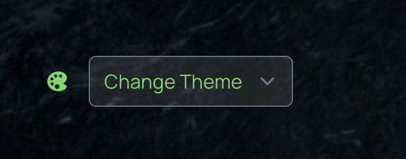
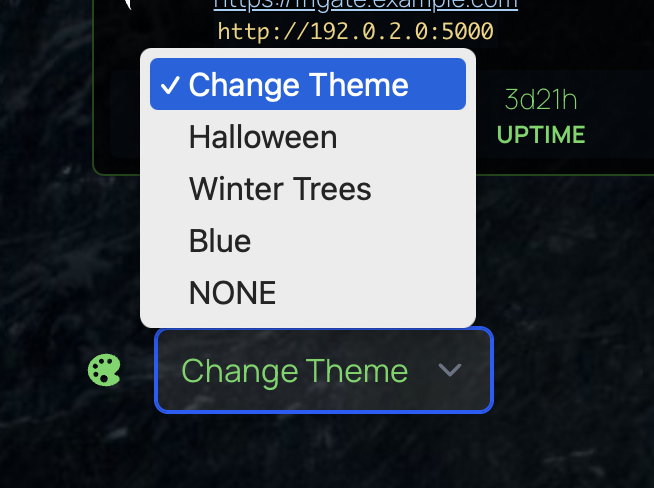

# Custom Theme Switcher

Allows you to create your own set of css based themes.

## Sample

|  |  |
|:--:|:--:| 

```javascript filename="custom.js"
#page_wrapper.xtheme-winter-trees {
    --cch-background-image: url('https://images.unsplash.com/photo-1517582082532-16a092d47074?q=80&w=1974&auto=format&fit=crop&ixlib=rb-4.0.3&ixid=M3wxMjA3fDB8MHxwaG90by1wYWdlfHx8fGVufDB8fHx8fA%3D%3D');
    --cch-card-border-color: rgb(52 194 48 / 35%);   
    --cch-card-bg-color: rgb(0 0 0 / 75%);   
    --color-200: 98 215 95;
}

#page_wrapper.xtheme-halloween {
    --cch-background-image: url('https://images.unsplash.com/photo-1472496175377-b5d7625d4ba9?q=80&w=2980&auto=format&fit=crop&ixlib=rb-4.0.3&ixid=M3wxMjA3fDB8MHxwaG90by1wYWdlfHx8fGVufDB8fHx8fA%3D%3D');
    --cch-card-border-color: rgb(255 165 0 / 35%);
    --cch-card-bg-color: rgb(0 0 0 / 35%);    
}

#page_wrapper.xtheme-winter-trees,
#page_wrapper.xtheme-halloween {
    #page_container {
        background-image: var(--cch-background-image);
        background-position: top;
        background-size: cover;
    }

    #information-widgets {
        border-color: var(--cch-card-border-color) !important;
        margin-top: 16px;
    }
    .service-card, li.bookmark a {
        background-color: var(--cch-card-bg-color) !important;
        border: 1px solid var(--cch-card-border-color);
    }
}
```

```javascript filename="custom.js"
initCustomThemes([
  {label: 'Halloween',    className: 'xtheme-halloween',    theme: 'dark',  color: 'slate'},
  {label: 'Winter Trees', className: 'xtheme-winter-trees', theme: 'dark',  color: 'slate'},
  {label: 'Blue',         className: 'xtheme-blue',         theme: 'light', color: 'blue'},
]);
```

## The Code

```javascript filename="custom.js"
/************************************
 **         Custom Theming         **
 ************************************/
const customThemeStorageKey = 'custom-theme';

/**
  * @param {Element} element
  * @param {Array<string | RegExp>} classNames
  */
function removeClassNames(element, classNames) {
  const remove = Array.from(element.classList).filter(
    name => classNames.some(
      unwanted => typeof unwanted === 'string' ? name === unwanted : unwanted.test(name)
    )
  )

  for (const name of remove) {
    element.classList.remove(name);
  }
}

/**
 * @typedef CustomThemeOptions
 * @type {object}
 * @property {string} label - Theme name for the select drop down
 * @property {string} [className] - Unique class name to add to the root element
 * @property {string} [theme] - Built in theme to apply https://gethomepage.dev/configs/settings/#theme
 * @property {string} [color] - Built in color to apply https://gethomepage.dev/configs/settings/#color
 */

/**
 * 
 * @param {CustomThemeOptions[]} options 
 * @param {*} selected 
 * @returns 
 */
function applyCustomTheme(options, selected) {
  if(!options || !selected) {
    return;
  }

  if(typeof selected === 'string' && selected.startsWith('{')) {
    selected = JSON.parse(selected);
  }

  if(typeof selected !== 'object' || !selected || !selected.label) {
    return;
  }

  const mainElem = document.getElementById('page_wrapper');
  if(!mainElem) {
    return;
  }
  
  /** @type {CustomThemeOptions} */
  const sel = selected;
  console.log('Applying custom theme', sel);

  // Always remove custom theme classes
  removeClassNames(mainElem, options.map(o => o.className).filter(o => !!o));
  if(sel.className) {
    mainElem.classList.add(sel.className);
    localStorage.setItem(customThemeStorageKey, sel.className);
  } else {
    localStorage.removeItem(customThemeStorageKey);
  }
  
  if(sel.theme) {
    removeClassNames(mainElem, ['light', 'dark']);
    mainElem.classList.add(sel.theme);
    localStorage.setItem('theme-mode', sel.theme);
  }
  
  if(sel.color) {
    // `color` in homepage config is actually the classes`theme-*`
    removeClassNames(mainElem, [/^theme-/]);
    mainElem.classList.add('theme-' + sel.color);
    localStorage.setItem('theme-color', sel.color);
  }
}

/**
 * 
 * @param {CustomThemeOptions[]} options 
 */
function initCustomThemes(options) {
  // Load prior theme
  const priorTheme = localStorage.getItem(customThemeStorageKey);
  if(priorTheme) {
    const priorOptions = options.find(o => o.className === priorTheme);
    if(priorOptions) {
      applyCustomTheme(options, priorOptions);
    }
  }

  // Adds a button to the bottom left of the page
  const selectElem = document.createElement('select');
  selectElem.className = 'w-32 rounded-md m-1 ml-4 bg-theme-300/20 dark:bg-white/10 text-theme-700 dark:text-theme-200 cursor-pointer';
  
  const placeholderElem = document.createElement('option');
  placeholderElem.setAttribute('value', '');
  placeholderElem.innerText = 'Change Theme';
  selectElem.appendChild(placeholderElem);

  for (const item of options) {
    const optionElem = document.createElement('option');
    optionElem.setAttribute('value', JSON.stringify(item));
    optionElem.innerText = item.label;
    selectElem.appendChild(optionElem);
  }

  const noneElem = document.createElement('option');
  noneElem.setAttribute('value', '{"label": "NONE"}');
  noneElem.innerText = 'NONE';
  selectElem.appendChild(noneElem);

  selectElem.onchange = function (ev) {
    applyCustomTheme(options, ev.target.value)
  };
  
  document.querySelector('#color').children[0].appendChild(selectElem);
}

/************************************
 **              MAIN              **
 ************************************/

initCustomThemes([
  {label: 'Dropdown Label', className: 'xtheme-my-theme', theme: 'dark',  color: 'slate'},
  {label: 'Theme 2',        className: 'xtheme-two'},
]);
```
| | |
|:--------|:-------------|
| `label` | Required. Theme name for the select drop down |
| `className` | Required. Unique class name to add to the root element.  I recommend the custom class names start with `xtheme-`. |
| `theme` | Built in theme to apply https://gethomepage.dev/configs/settings/#theme |
| `color` | Built in color to apply https://gethomepage.dev/configs/settings/#color |

### `settings.yaml` cautions
This script may not work consistently if you set the same values in js/css as in `setting.yaml`.  It's best to avoid setting `theme`, `color`, or `background` if you want to manage them the custom theme script.
