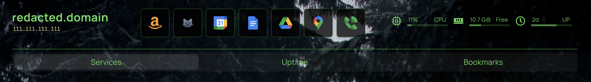

# Favorites / Bookmarks Bar

Add a bookmarks bar to the center'ish of the header.

## Sample



```yaml filename="bookmarks.yaml"
- Favorites:
    - Amazon:
        - href: https://www.amazon.com/
          icon: /images/amazon-logo-orange.png
    - Cat Cam:
        - href: https://frigate.example.net/#cat_cam
          icon: mdi-cat
    - Google Calendar:
        - href: https://calendar.google.com
          icon: https://cdn.jsdelivr.net/gh/selfhst/icons/svg/google-calendar.svg
    # ...
```


## The Code

> [!NOTE]
>
> Needs `querySelectorContent()` from [common code](./common)

```javascript filename="custom.js"
/************************************
 **         Style Favorites        **
 ************************************/

function styleFavorites() {
  const bookmarksElem = querySelectorContent('.bookmark-group', 'Favorites')
  if(!bookmarksElem) {
    console.error(`Can't find Bookmark 'Favorites'`)
  }
  bookmarksElem.classList.add('bookmark-favorites');

  // Move to between Header and Tabs
  const sourceElem = bookmarksElem.querySelector('ul');
  const targetElem = querySelectorContent('.information-widget-greeting', '{FAVORITES}')
  if(targetElem && sourceElem) {
    const wrapper = document.createElement('div');
    wrapper.className = 'widget-container bookmark-favorites-wrapper flex flex-row flex-wrap justify-between m-5 mt-0 mb-0';
    wrapper.appendChild(bookmarksElem);
    targetElem.after(wrapper);
    targetElem.classList.add('hidden');
  }
}


/************************************
 **              MAIN              **
 ************************************/

styleFavorites();
```


```css filename="custom.css"
/* Formatting for the bookmarks-group 'Favorites' */
.bookmark-favorites-wrapper {
    margin-top: 0;
    flex-grow: 1;
}
.bookmark-favorites { 
    button { display: none; }
    ul {
        display: flex;
        align-items: center;
        justify-content: center;
        flex-flow: wrap;
    }
}

/* optional, reset widget alignment */
#widgets-wrap {
    justify-content: start;
}

```

