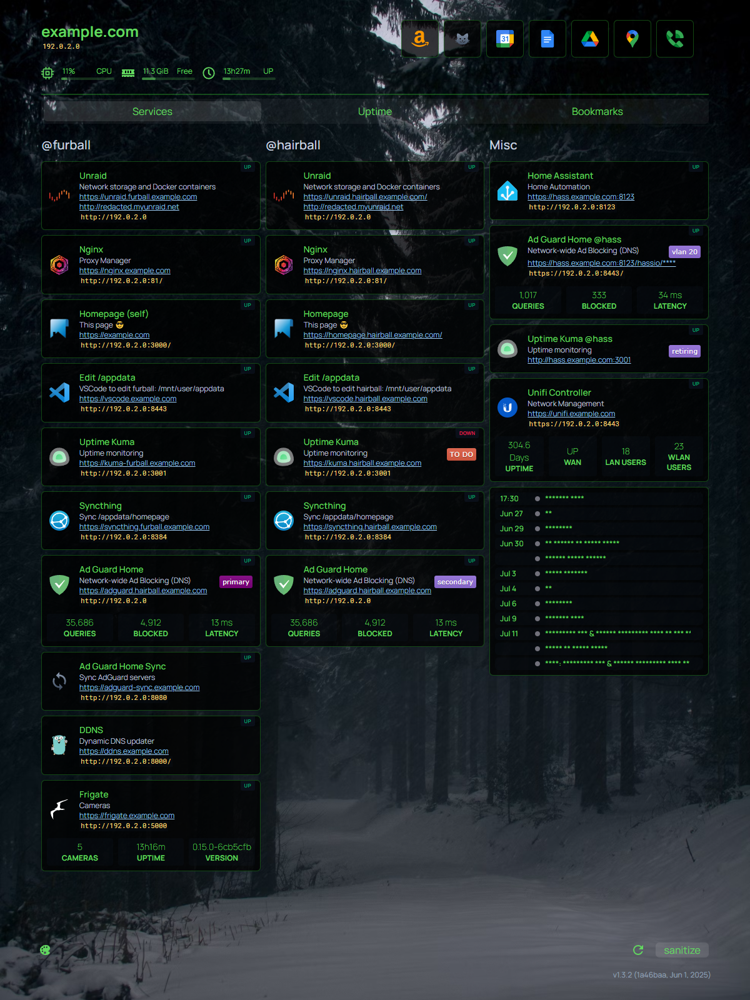

# Homepage
https://gethomepage.dev/

I use the [Custom New Tab URL](https://chromewebstore.google.com/detail/custom-new-tab-url/mmjbdbjnoablegbkcklggeknkfcjkjia) Chrome Extension to replace the default new tab page.  This is the start of documentation for all the services running on my home network.  I list the dns and ip address for each service, pings, uptime, etc.

