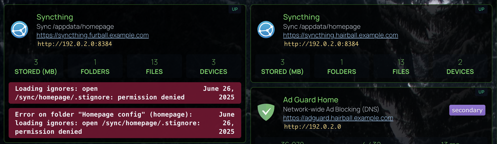

# Syncthing Widgets

Using the Custom API widget to pull the basic stats from Syncthing, and any errors.  The code below has 2 widgets.  The first shows the stats (Thanks to [AndyPro720](https://old.reddit.com/r/selfhosted/comments/1c185g3/syncthing_homepage_widget/)).  The seconds shows errors, if any.

## Sample




## The Code

```yaml filename="services.yaml"
    - Syncthing:
        href: https://syncthing.hairball.example.net
        icon: https://cdn.jsdelivr.net/gh/selfhst/icons/svg/syncthing.svg
        # container: UptimeKuma
        siteMonitor: http://192.0.2.0:8384
        description: |-
          Sync /appdata/homepage
          https://syncthing.hairball.example.net
          `http://192.0.2.0:8384`
        widgets:
          - type: customapi
            url: http://192.0.2.0:8384/rest/svc/report
            headers:
              X-API-Key: "{{HOMEPAGE_VAR_SYNCTHING_HAIRBALL_KEY}}" 
            mappings:
              - field: totMiB
                label: Stored (MB)
                format: number
              - field: numFolders
                label: Folders
                format: number
              - field: totFiles
                label: Files
                format: number
              - field: numDevices
                label: Devices
                format: number
          - type: customapi
            hideErrors: true
            url: http://192.0.2.0:8384/rest/system/error
            headers:
              X-API-Key: "{{HOMEPAGE_VAR_SYNCTHING_HAIRBALL_KEY}}" 
            display: dynamic-list
            mappings:
              items: errors
              label: when
              name: message
              format: date
              limit: 5
```


```css filename="custom.css"
/* Syncthing errors */
li[data-name=Syncthing] .service-container:nth-of-type(3) .items-center {
    color: rgb(var(--color-100) / 1);
    background-color: color-mix(in oklab,var(--color-rose-900)80%,transparent);

    div {
        font-weight: bold;
        font-family: 'Roboto Mono', 'Monaco', 'Menlo', 'Ubuntu Mono', 'Consolas', 'source-code-pro', monospace; 
    }
}
```
