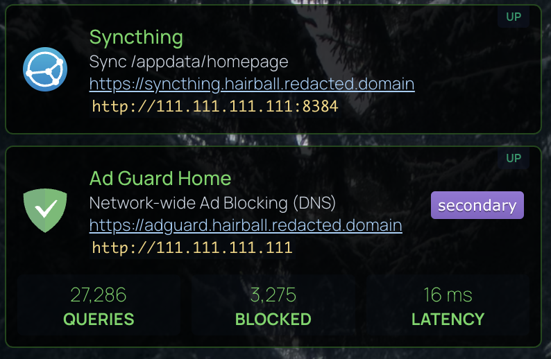

# Markdown in Homepage

This adds markdown support for Service Descriptions and Greeting Widgets. You can add other sections by editing the parameters of `initMarkdown()`.

## Sample 


```yaml filename="services.yaml"
    - Syncthing:
        href: https://syncthing.hairball.******.net
        icon: https://cdn.jsdelivr.net/gh/selfhst/icons/svg/syncthing.svg
        # container: UptimeKuma
        siteMonitor: http://192111.111.111.111:8384
        description: |-
          Sync /appdata/homepage
          https://syncthing.hairball.******.net
          `http://111.111.111.111:8384`

    - Ad Guard Home:
        href: https://adguard.hairball.******.net/
        icon: https://cdn.jsdelivr.net/gh/selfhst/icons/svg/adguard-home.svg
        siteMonitor: http://111.111.111.111
        description: |-
          Network-wide Ad Blocking (DNS)

          https://adguard.hairball.******.net
          `http://111.111.111.111`
        widget:
          type: adguard
          url: https://adguard.hairball.******.net
          username: "******"
          password: "{{HOMEPAGE_VAR_ADGUARD_FURBALL_KEY}}"
          fields:
            - queries
            - blocked
            # - filtered
            - latency
```
## The Code

> [!NOTE]
>
> Needs `runNowAndTabClick()` from [common code](./common)

```javascript filename="custom.js"
/************************************
 **            Markdown            **
 ************************************/
// TODO: `.service-description` is `<p>`, must change to `<div`
//       https://stackoverflow.com/questions/13389751/change-tag-using-javascript
// TODO: All list and other formatting was erased by MaterialUI css, need to selectively re-add to the css

function markdownDescriptions(options) {
  // https://github.com/markdown-it/markdown-it
  // https://markdown-it.github.io/
  const script = `
  import markdownIt from 'https://cdn.jsdelivr.net/npm/markdown-it@14.1.0/+esm';
  import externalLinks from 'https://cdn.jsdelivr.net/npm/markdown-it-external-links@0.0.6/+esm';
  const md = markdownIt({
      breaks: true,
      html: ` + !!options.html + `,
      linkify: ` + !!options.linkify + `,
      typographer: true,
    })
    .use(externalLinks, {
      externalTarget: '_blank',
      externalRel: 'noreferrer',
      internalDomains: [],
    });
  

  const nodes = document.querySelectorAll('` + options.selector + `') || [];
  for (const node of nodes) {
    try {
      if (node.classList.contains('markdown-wrapper')) {
        continue;
      }

      let html = md.render(node.textContent).trim();

      /* Remove the extra <p> wrapping the generated html */
      if (html.startsWith('<p>') && html.endsWith('</p>')) {
        html = html.substring(3, html.length - 4);
      }

      if (node.textContent !== html) {
        /* console.log({ src: node.textContent, html }); */
        node.innerHTML = html;
        node.classList.add('markdown-wrapper');
      }
    } catch (err) {
      console.error(err);
    }
  }
  `;

  const node = document.createElement('script');
  node.setAttribute('type', 'module');
  node.innerText = script;
  document.body.appendChild(node);
}

function applyMarkdown(options) {
  for (const opts of options) {
    markdownDescriptions(opts);      
  }
}

/************************************
 **              MAIN              **
 ************************************/

runNowAndTabClick(function () {
  applyMarkdown([
    {selector: '.information-widget-greeting span', linkify: false, html: false},
    {selector: '.service-description',              linkify: true,  html: false},
  ]);
})
```


```css filename="custom.css"
/* Formatting for markdown blocks, since default element formatting has been removed. */
.markdown-wrapper {
  /* white-space: pre-wrap; */

  a {
    color: #9ecef7;
    /* color: #72e0d1; */
    text-decoration: underline;
  }
  i,
  em {
    font-style: italic;
  }
  b,
  strong {
    font-weight: bold;
  }
  h1 {
    font-size: x-large;
    font-weight: bold;
  }
  h2 {
    font-size: large;
    font-weight: bold;
  }
  ol,
  ul {
    display: block;
    padding-inline-start: 2ch;
  }
  ol {
    list-style-type: decimal;
  }
  ul {
    list-style-type: disc;
  }
  li {
    display: list-item;
    text-align: -webkit-match-parent;
    unicode-bidi: isolate;
  }
  hr {
    margin-bottom: 2px;
    margin-top: 2px;
    border-width: 0;
    border-top: 3px solid rgb(var(--color-200) / 0.5);
  }
  code,
  pre {
    font-family: "Roboto Mono", "Monaco", "Menlo", "Ubuntu Mono", "Consolas",
      "source-code-pro", monospace;
    font-size: 0.9em;
    background-color: rgb(var(--color-900) / 0.2);
    padding: 2px;
    color: #f5d67b;
  }

  /* Right align status image badges in markdown
    * The [text] must contain the work "badge"
    * i.e. 
    */
  img[alt~="badge"] {
    float: right;
    margin-left: 4px;
  }
}
```
