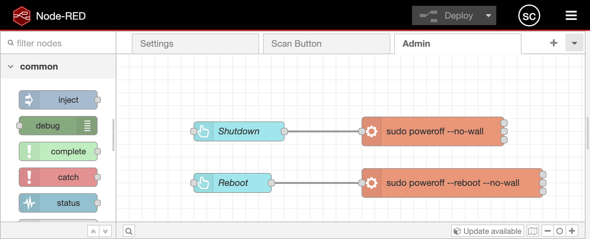

# ScanSnap s1500


(Yes, I could have cropped the photo, but... cat tax 😺)

* Fujitsu ScanSnap S1500
* Raspberry Pi 4
* [Raspberry Pi Touch Display v1](https://www.raspberrypi.com/documentation/accessories/display.html)
* [Raspberry pi 7" Display Stand_FULL assembly V2.0](https://www.thingiverse.com/thing:2756684) -- This is for V1 of the official 7" display.  WARNING: Designed for RPi 3, not 4!  I can't put the back on. 


Many thanks to:  
* Better instructions: https://chrisschuld.com/network-scanner-with-scansnap-and-raspberry-pi/
* Extra installs: https://github.com/rocketraman/sane-scan-pdf/wiki/Dependencies-Installation
* http://howto.philippkeller.com/2018/02/08/Scan-with-raspberry-pi-convert-with-aws-to-searchable-PDF/

## RPi image
1. https://www.raspberrypi.com/software/
2. Configure the installer:
  * Set hostname
  * Enable wifi
  * Set user/password
  * Enable SSH

## Setup the RPi
```sh
sudo apt-get update
sudo apt-get upgrade
sudo apt install sane sane-utils scanbd git imagemagick -y
sudo apt install \
  netpbm \
  ghostscript \
  poppler-utils \
  imagemagick \
  unpaper \
  util-linux \
  tesseract-ocr \
  parallel \
  units \
  bc

cd $HOME
git clone https://github.com/rocketraman/sane-scan-pdf.git

```

```sh filename="/etc/scanbd/scanbd.conf"
# edit the `scriptdir=` line
    scriptdir=/etc/scanbd/scripts

# add this to the `action scan` section
    desc = "Scan to file and share"
    script = "scan.sh"
```

Create this file
```sh filename="/etc/scanbd/scripts/scan.sh"
#!/bin/sh
now=`date +"%Y-%m-%d-%H%M"`
/home/pi/sane-scan-pdf/scan -d -r 300 -v -m Lineart --skip-empty-pages -o /home/pi/scans/scan-$now.pdf
```

```sh
sudo chmod +x /etc/scanbd/scripts/scan.sh
```

## Upload to SMB share
Mount a remote SMB share, to upload scans to.  I set it up pointing to the input (consumption) folder on my [paperless-ngx](https://docs.paperless-ngx.com/) server.
```sh
sudo apt install cifs-utils
```

***below is from Google, and edited***

-  Mount the SMB Share (Persistent - using `/etc/fstab`):
For the share to be mounted automatically on boot, add an entry to your `/etc/fstab` file. This is generally preferred for permanent mounts.
Create a credentials file (optional but recommended):
This keeps your username and password out of the fstab file directly. Create a file (e.g., `~/.smbcredentials`) and add your username and password:
```
    username=YOUR_SMB_USERNAME
    password=YOUR_SMB_PASSWORD
```
Set appropriate permissions for this file:
```
    chmod 600 ~/.smbcredentials
```

Edit `/etc/fstab`.
Open the file with a text editor (e.g., nano):
```
    sudo nano `/etc/fstab`
```

Add a line similar to the following, adjusting the path to your credentials file and the mount options as needed:
```
    //SERVER_IP/SHARE_NAME /home/pi/myshare cifs credentials=/home/pi/.smbcredentials,uid=1000,gid=1000,nofail 0 0
```
`uid=1000,gid=1000`: Sets the ownership of the mounted files to the default pi user (you can find your user's UID and GID with the id command).
`nofail`: Prevents the system from failing to boot if the network share is unavailable.
-  Test the Mount:
After editing fstab, you can test the mount without rebooting:
```
sudo mount -a
```

## Kiosk mode
Source: https://www.raspberrypi.com/tutorials/how-to-use-a-raspberry-pi-in-kiosk-mode/

`sudo raspi-config`
1. Select System Options > Boot / Auto Login > Desktop Autologin: Desktop GUI, automatically logged in as 'pi' user.
2. sudo nano .config/wayfire.ini
3. Add:
```
[autostart]
chromium = chromium-browser https://raspberrypi.com --kiosk --noerrdialogs --disable-infobars --no-first-run --ozone-platform=wayland --enable-features=OverlayScrollbar --start-maximized --enable-wayland-ime --wayland-text-input-version=3
screensaver = false
dpms = false
```
Note: I added `--enable-wayland-ime --wayland-text-input-version=3` to enable the on screen keyboard 

Install on-screen keyboard
```sh
sudo apt install wvkbd
```

> [!WARNING]
>
> I could never get the on-screen keyboard to work in kiosk mode.  It only works in normal mode 😢.  
> So I ended up using a bluetooth keyboard.


## Node Red
### Installation
https://nodered.org/docs/getting-started/raspberrypi
```
bash <(curl -sL https://github.com/node-red/linux-installers/releases/latest/download/update-nodejs-and-nodered-deb)
```

### Config
1. `mkdir /home/pi/node-red-static/`
2. Edit the `httpStatic` section of node-red settings
```js filename="/home/pi/.node-red/settings.js"
    httpStatic: [
        {path: '/home/pi/node-red-static/',    root: "/static/"}, 
    ],
```

### Plugins
1. Hamburger menu
2. Manage pallette
3. Install `@flowfuse/node-red-dashboard`

### Flows
Blow are screenshots of the Flow diagrams.  The latest code is on [github](https://github.com/chilltemp/scanner-control-nodered).





## Custom scripts
Customize the original trigger script and make a wrapper for the per-page script, so that
we can send notifications to nodered.  This provides onscreen feedback.

### Custom trigger script
```sh filename="/etc/scanbd/scripts/scan.s"
#!/bin/sh

# trigger node-red scan
wget -qO- http://scanner.local:1880/scan

# notify and copy to network share
wget -qO- --post-data "status=Uploading..." http://scanner.local:1880/scan-status
mv /home/pi/scans/*.pdf /mnt/paperless/
wget -qO- --post-data "status=" http://scanner.local:1880/scan-status
```

### Custom per page script
```sh filename="/home/pi/scan-per-page-helper"
#!/bin/bash
echo scan-per-page-helper: $1

/home/pi/sane-scan-pdf/scan_perpage $1
status=$?

# try to copy to node-red static folder, and notify node-red if success
# blank pages (and errors) aren't converted to pdf, so don't notify node-red
cp $1.pdf /home/pi/node-red-static/ && wget -qO- --post-data "image=$(basename $1).pdf" http://scanner.local:1880/scanned

exit $status
```

### Tell sane-scan-pdf to use custom per page script
```sh
mkdir -p /home/pi/.local/share/sane-scan-pdf/
nano /home/pi/.local/share/sane-scan-pdf/defaults
```
```sh filename="/home/pi/.local/share/sane-scan-pdf/defaults"
SCRIPT=/home/pi/scan-per-page-helper
```

### Initial config file
~~You need to prepopulate the config file so node-red can read items~~ \
FIXED: This shouldn't be needed any more.
```json filename=" scan-config.json "
{"dpi":600,"mode":"Lineart","duplex":false,"skipBlank":true,"whiteThreshold":99.6}
```

