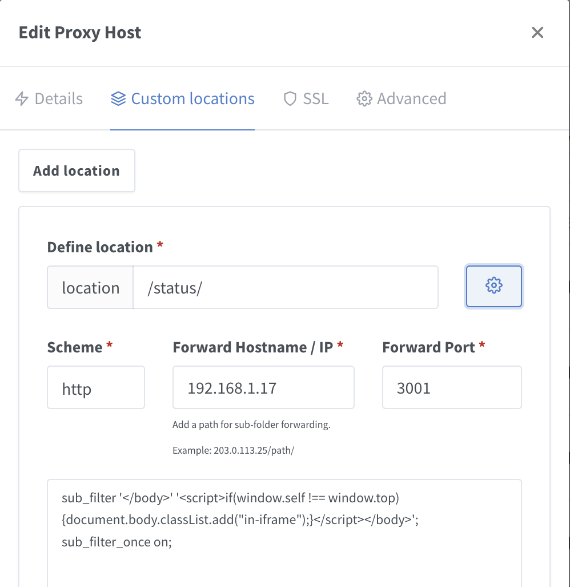

# Status in an iFrame
Uptime Kuma doesn't want to run in an iFrame.  But many people want Status Pages embedded else ware.

## Disable iFrame Blocking
Add this environment variable to the docker config
```dotenv copy
UPTIME_KUMA_DISABLE_FRAME_SAMEORIGIN = true
```

## iFrame specific css
Uptime Kuma supports custom css but not custom javascript on Status Pages.  I'm already using nginx to serve all my internal services via https.  Nginx can also do simple string replacement in the content it proxies.  

### nginx config
This injects a tiny script at the bottom of the page.  The script adds the class `in-frame` to the body if the page is in an iFrame.

* Add a Custom Location for `/status/` (both slashes are required)
* Scheme, IP, & port should all be the same as the Details tab
* Click the gear icon to show the advanced config, and add:
```text copy
sub_filter '</body>' '<script>if(window.self !== window.top) {document.body.classList.add("in-iframe");}</script></body>';
sub_filter_once on;
```



### Kuma config
The code below reduces whitespace and hides management buttons, titles, etc.  So that just the monitors are shown.

```css copy filename="Status page Custom CSS"

body.in-iframe {

    /* Hide stuff */
    .main .title-flex,
    .main .group-title,
    .main>div>div>button.btn-info,
    .main>div>div>a.btn-info {
        display: none;
    }

    /* background */
    body,
    .overall-status,
    .monitor-list {
        background: transparent !important;
    }

    /* reduce whitespace */
    .main {
        padding: 0;
    }

    .main>div,
    .main>div>div {
        margin: 0 !important;
        padding: 0 !important;
    }

    .item {
        padding: 2px !important;
    }

    @media screen and (max-width: 600px) {
        #app>.container {
            padding: 0 0.3rem;
        }

        .row>* {
            padding: 0 !important;
        }
    }

    .overall-status {
        font-size: 1rem !important;
    }
}
```